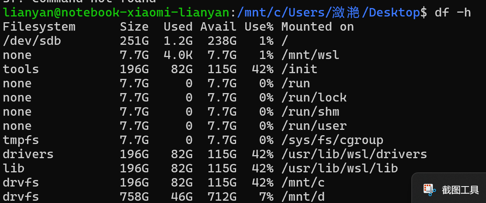
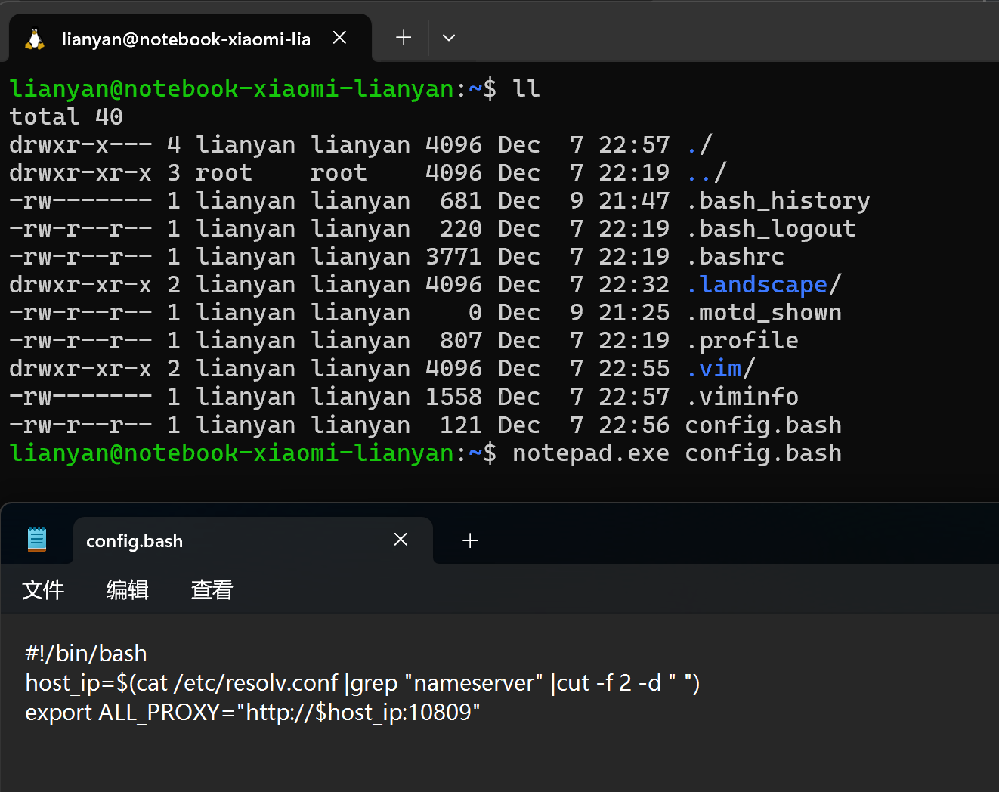
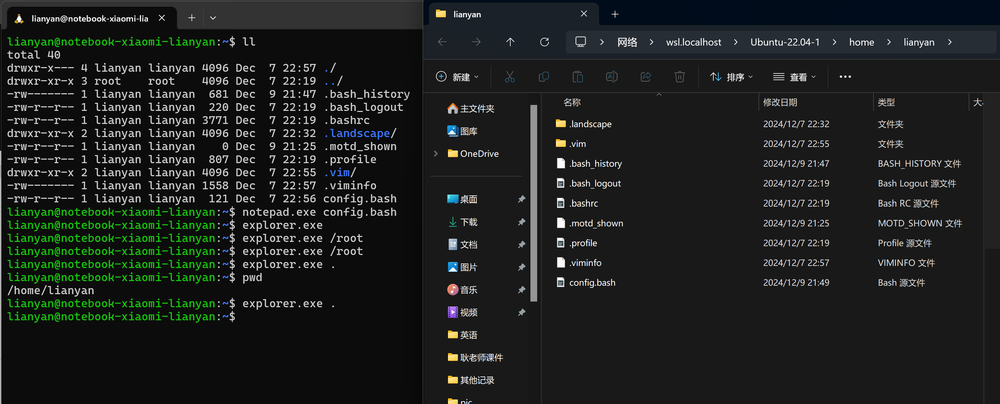
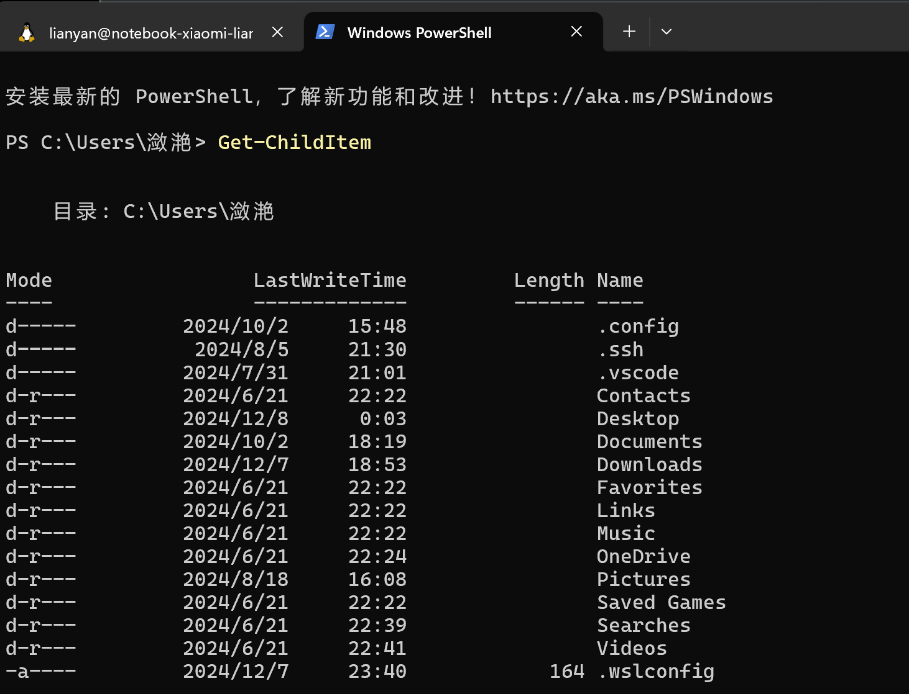
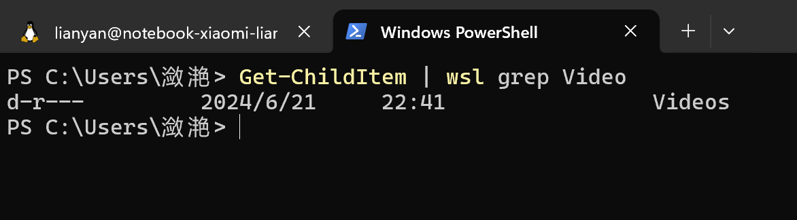

# w11安装wsl2

## 1.准备工作

### 先在Windows功能中开启三项：

Windows虚拟机监控程序平台、虚拟机平台 和 适用于Linux的Windows子系统。然后重启电脑。

### 更新wsl内核：

参见博文：

[链接1]: https://blog.csdn.net/dddgggd/article/details/132306786
[链接2]: https://learn.microsoft.com/zh-cn/windows/wsl/install-manual#step-4—download-the-linux-kernel-update-package


执行指令：`wsl --update --web-download`进行更新(更新了后才能使用wslg)，需翻墙。

更新完成后可以用指令查看版本信息：

```bash
PS C:\Users\潋滟\Desktop> wsl --version
WSL 版本： 2.3.26.0
内核版本： 5.15.167.4-1
WSLg 版本： 1.0.65
MSRDC 版本： 1.2.5620
Direct3D 版本： 1.611.1-81528511
DXCore 版本： 10.0.26100.1-240331-1435.ge-release
Windows 版本： 10.0.22631.4460
```

## 2.安装

打开v2ray并开启代理

以管理员身份打开命令提示符

执行指令：

```bash
wsl --set-default-version 2

# 查看列表
wsl --list --online
wsl --install -d Ubuntu-22.04
```

给root用户创建密码：`sudo passwd root`

看网上的教程安装后会提示新建用户和密码，但是本机器上安装不会，一直卡在：Installing, this may take a few minutes...这一行，所以自己手动来创建新用户并设置默认用户：

```bash
# 新建用户

# 1.创建新用户，并赋予相应的权限
adduser xxx # xxx 你的用户名，注意为小写字母加数字
# 上述指令结束后会让你输入密码，正常输入即可
# 输入密码后，会让你输入个人信息，一直点击enter即可

# 2.为用户赋予sudo权限[略过-->必须,有问题]
vim /etc/sudoers
# 增加配置, 在打开的配置文件中，找到root ALL=(ALL:ALL) ALL, 在下面添加一行
# 其中xxx是你要加入的用户名称
xxx ALL=(ALL:ALL) ALL
# 按esc，输入:wq!保存配置

# 3.设置该用户为默认启动用户
vim /etc/wsl.conf
# 在最后添加配置
[user]
default=你的用户名
# 按esc，输入:wq保存配置

# 4.退出此子系统然后重启完成修改
# 进入windows终端输入
wsl --shutdown
# 再次重新进入ubuntu，完成修改

```

## 3.其他问题

### 1.“wsl: 检测到 localhost 代理配置，但未镜像到 WSL。NAT 模式下的 WSL 不支持 localhost 代理。”

在Windows中的目录路径应类似于：`C:\Users\<UserName>`目录下创建一个.wslconfig文件，然后在文件中写入如下内容:

```bash
[wsl2]
nestedVirtualization=true
ipv6=true
[experimental]
autoMemoryReclaim=gradual  
networkingMode=mirrored
dnsTunneling=true
firewall=true
autoProxy=true
```

然后用`wsl --shutdown`关闭WSL，之后再重启。

### 2.网络修改

方式1：网络镜像(子系统和Windows共用同一个IP地址)

修改文件：`C:\Users\<UserName>\.wslconfig`

```toml
[wsl2]
nestedVirtualization=true
[experimental]
autoMemoryReclaim=gradual
networkingMode=mirrored
dnsTunneling=true
firewall=true
autoProxy=true
sparseVhd=true
```

可选：如果Windows上开启了代理，那么可以根据代理端口来进行测试，例如：

`curl -x http://127.0.0.1:10809 -fsSL www.google.com`

有输出则代理成功！


可以写进~/.bashrc:

```bash
export http_proxy=http://127.0.0.1:10809
export https_proxy=https://127.0.0.1:10809
```

`source ~/.bashrc`即可。

再次测试：`curl -I http://x.com`或者 `wget http://x.com`

但是发现根本ping不同外网地址，如ping youtube.com。本来就ping不通。


方式2：网络NAT

由于我想在Windows上使用clion且将wsl作为linux远程端，我需要固定IP其不能再使用镜像的方式配置网络了(Windows在使用22端口，linux也会使用22端口，感觉会冲突)

取消使用镜像网络即可：

networkingMode=NAT

## 4.指令

查看哪些已安装及状态：

```shell
wsl -l -v
```

启动：

通过终端启动或者通过以下指令启动

```shell
wsl -d 子系统名字

# 退出输入exit 或者 键盘ctrl+d
# 会自动停止运行
```

停止：

```shell
# 停止所有
wsl --shutdown

# 停止指定
wsl --terminate <DistributionName>
```

切换默认子系统：

```shell
wsl --set-default <DistroName>

对应执行wsl指令时就会运行这个默认子系统
```

卸载：

```shell
wsl --unregister <DistroName>
```

备份与恢复：

```bash
# 备份(最好先将需要备份的子系统停止)
wsl --export <DistroName> test.tar

# 导入[可以用此方法将子系统放到其他磁盘]
cd D:
wsl --import Ubuntu-22.04-1 D:/WSL2 C:\Users\潋滟\Desktop\test.tar
# 上面这个指令相当于存放到D盘去了[可以将之前的子系统删除掉]。最终会在D:/WSL2目录下得到一个为.vhdx后缀的文件

```

## 5.文件共享

在linux子系统下采用df -h指令查看挂载，发现其实Windows系统的磁盘都挂载进来了的。

如下图：



C D盘直接作为目录挂载进了linux系统。注意：使用此种挂载卷的方式IO性能不是很好，如果linux中涉及大量IO操作建议是把文件拷入linux子系统中来使用。

Windows如何查看linux文件：


## 6.命令混用

在Windows中可以直接运行Linux命令，在Linux中又可以直接运行Windows程序。

### 1.Linux中运行Windows程序

使用Windows的记事本工具：



使用此记事本进行修改保存后都是可以保存生效到Linux中的。


使用Windows资源管理器打开当前目录：



使用Windows来进行增删改查都是可以同步更新的。

### 2.Windows中运行Linux命令

在powershell下执行一条Windows指令：`Get-ChildItem`



会显示当前文件夹的所有内容。

对此命令作过滤，Linux版本的过滤是使用grep，可以混写指令：

`Get-ChildItem | wsl grep Video`



### 3.WSLg

WSLg允许Linux系统带UI的应用程序直接以Windows窗口的形式打开，它是利用了RDP远程桌面协议。但根据弹幕的说法他也是有缺点的：即在开启代理的情况下，进场闪崩。

sudo apt install gnome-clocks

sudo apt install xclock

可以终端输入xclock或者gnome-clocks查看图形化界面。

解决中文乱码：

`sudo apt-get install fonts-wqy-zenhei`

### 4.显卡驱动英伟达

指令：`nvdia-smi`

由于本笔记本只有核显,没有英伟达显卡就不管。


## 7.配置文件

wsl的两种配置文件的官方文档为：https://learn.microsoft.com/en-us/windows/wsl/wsl-config

​	可以通过以下两种方式配置已安装的 Linux 发行版的设置，这些设置将在每次启动 WSL 时自动应用：

- **[.wslconfig](https://learn.microsoft.com/en-us/windows/wsl/wsl-config#wslconfig)**用于配置**在 WSL 2 上运行的所有已安装发行版的全局设置**。
- **[wsl.conf](https://learn.microsoft.com/en-us/windows/wsl/wsl-config#wslconf)** 用于为在 WSL 1 或 WSL 2 上运行的每个 Linux 发行版配置**每个发行版的本地设置**。

两种文件类型都用于配置 WSL 设置，但是文件存储的位置、配置范围、可配置的选项类型以及运行发行版的 WSL 版本都会影响选择哪种文件类型。

WSL 1 和 WSL 2 采用不同的架构运行，将影响配置设置。WSL 2 作为轻量级虚拟机 (VM) 运行，因此使用虚拟化设置，允许您控制使用的内存或处理器数量（如果您使用 Hyper-V 或 VirtualBox，则可能对此很熟悉）。[检查您正在运行哪个版本的 WSL。](https://learn.microsoft.com/en-us/windows/wsl/install#check-which-version-of-wsl-you-are-running)


### 配置更改的 8 秒规则

您必须等到运行 Linux 发行版的子系统完全停止运行并重新启动，配置设置更新才会出现。这通常在关闭发行版 shell 的所有实例后需要大约 8 秒钟。

如果您启动发行版（例如 Ubuntu），修改配置文件，关闭发行版，然后重新启动它，您可能会认为您的配置更改已立即生效。目前情况并非如此，因为子系统可能仍在运行。您必须等待子系统停止后再重新启动，以便有足够的时间让更改生效。您可以使用 PowerShell 检查您的 Linux 发行版（shell）在关闭后是否仍在运行，方法是使用以下命令：`wsl --list --running`。如果没有发行版正在运行，您将收到响应：“没有正在运行的发行版。”您现在可以重新启动发行版以查看已应用的配置更新。

该命令`wsl --shutdown`是重新启动 WSL 2 发行版的快捷方式，但它会关闭所有正在运行的发行版，因此请谨慎使用。您还可以使用它`wsl --terminate <distroName>`来立即终止正在运行的特定发行版。


## 8.转移

由于我想
